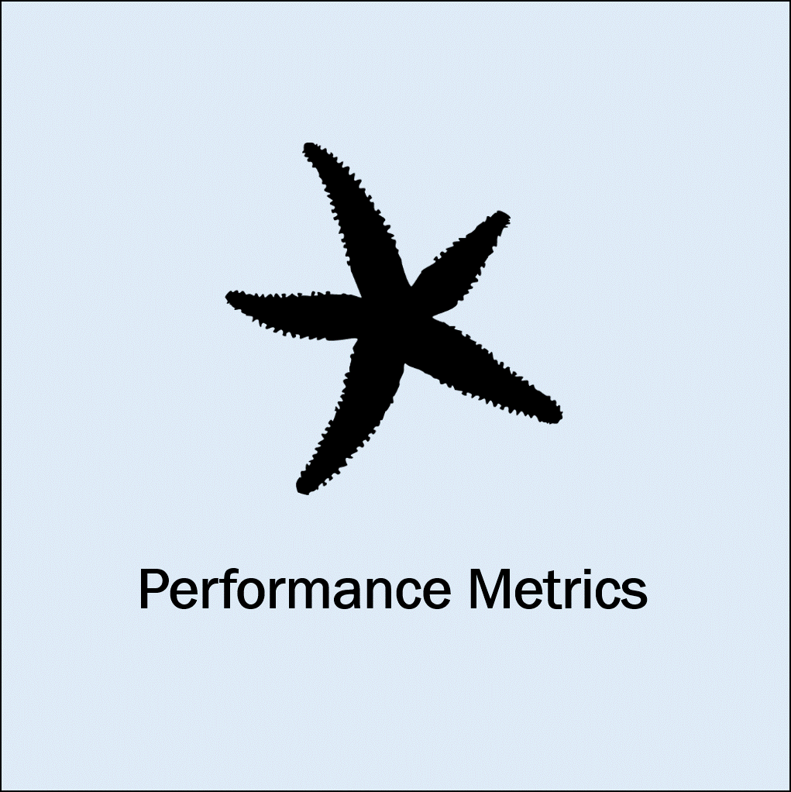
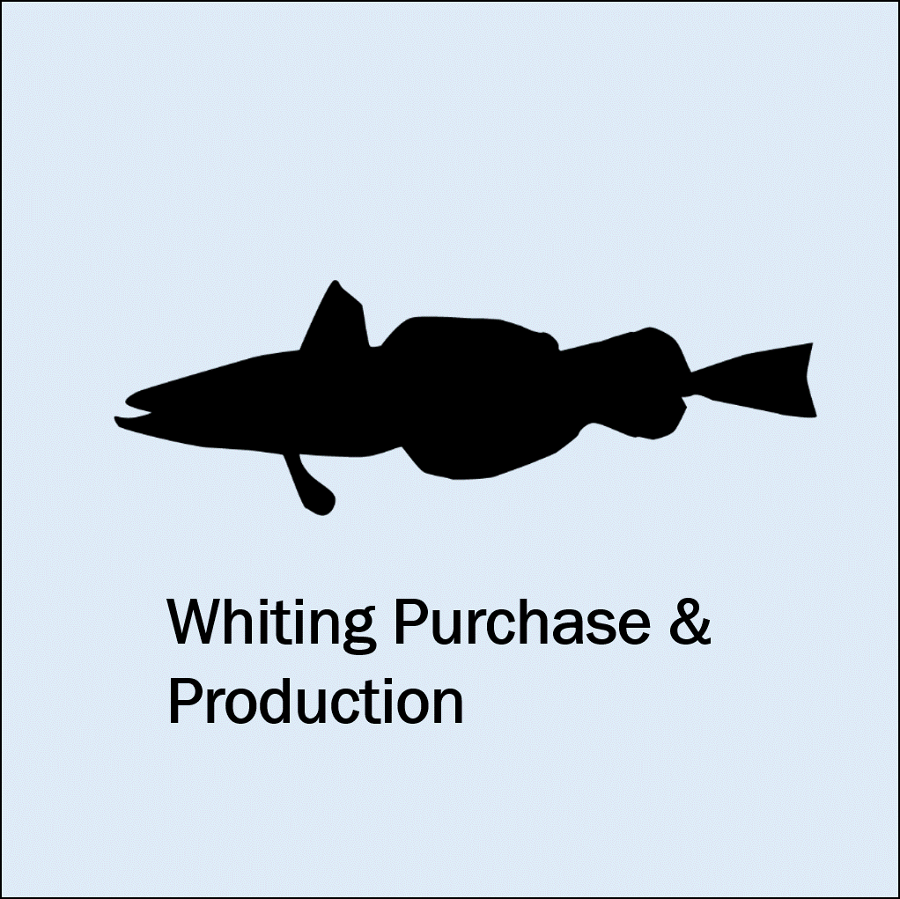

 
  
  
Welcome to FISHEyE

 

::: {.large-text}
*"A set of tools for exploring data for the West Coast Groundfish Trawl Catch Share program. The data were collected by the NWFSC Economics and Social Science Program and include data from the Economic Data Collection Program, the NWFSC Pacific Coast Groundfish Social Science Survey. PacFIN data are also incorporated into the data tools."*

:::

 

  
  
  

